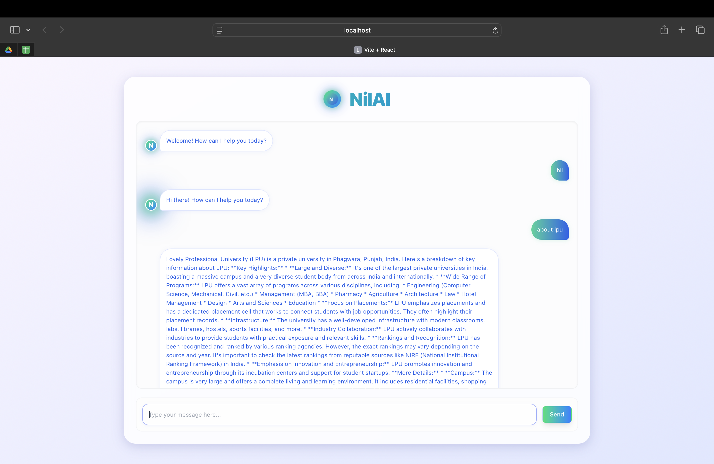

# 🤖 NilAI Chat Bot

NilAI is an advanced conversational AI chatbot inspired by **Gemini AI**, developed to provide intelligent, contextual, and interactive conversations. It features a sleek frontend and robust backend, integrating the Google Gemini API to simulate a natural human-like assistant experience.

---

## 🚀 Features

- 🌐 Real-time conversational AI with RESTful backend
- 📄 Multi-turn context understanding
- 🎨 Gemini-inspired clean and modern UI using React + Tailwind
- 🧠 Intelligent response generation via Google Gemini LLM API
- ☁️ Easy local deployment
- 🧩 Modular and scalable codebase

---

## 📸 Preview

> Sample:
> 

---

## 🛠️ Tech Stack

| Technology           | Use                              |
| -------------------- | -------------------------------- |
| React.js (Vite)      | Frontend UI                      |
| Tailwind CSS         | Styling and layout               |
| Node.js / Express.js | Backend server & API endpoint    |
| Google Gemini API    | Large Language Model Integration |
| Axios / Postman      | API Communication & Testing      |
| Bash / CURL          | Local testing & debugging        |

---

---

## ⚙️ Getting Started

### 1. Clone the Repository

```bash
git clone https://github.com/Nilesh091/NilAI.git
cd NilAI
```

### 2. Install Dependencies

Install dependencies in both frontend and backend directories:

```bash
cd clint
npm install

cd ../server
npm install
```

### 3. Add Environment Variables

Create a .env file inside the server/ directory and add:

```bash
GEMINI_API_KEY=your_gemini_api_key_here
```

Replace with your actual Google Gemini API key from Google AI Studio.

### 4. Run the Backend

```bash
cd server
node index.js
```

### 5. Run the Frontend

```bash
cd client
npm run dev
```

### 👨‍💻 Author

-Made with ❤️ by Nilesh Ranjan Sahu
